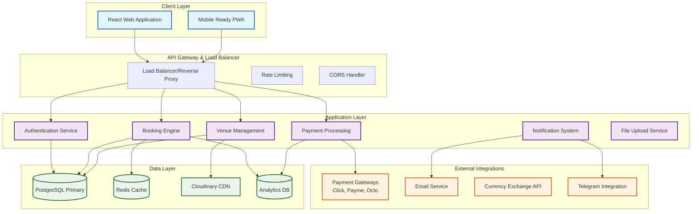
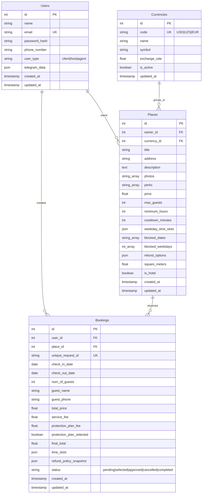
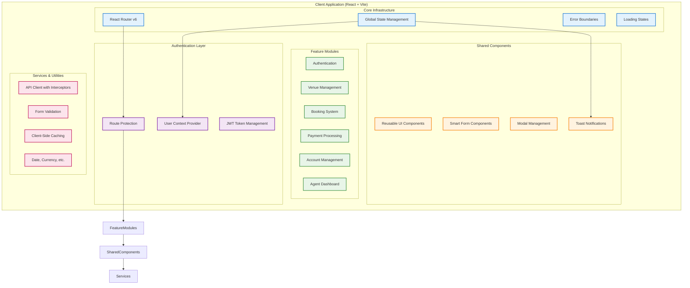
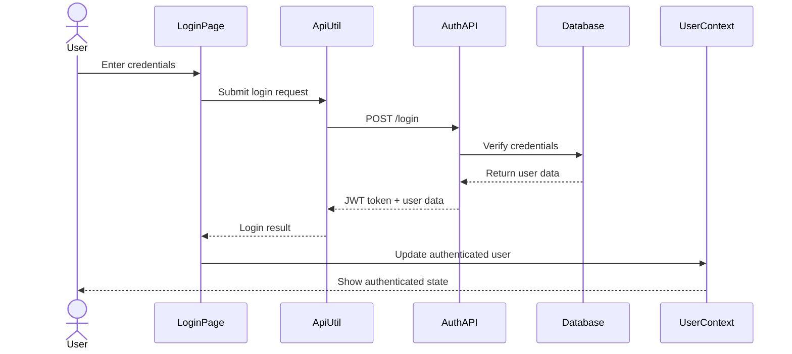
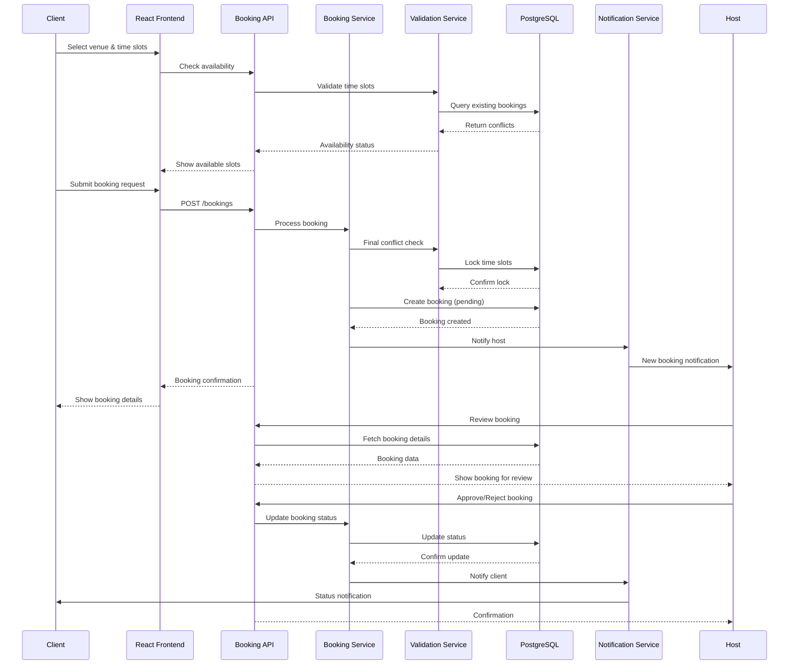
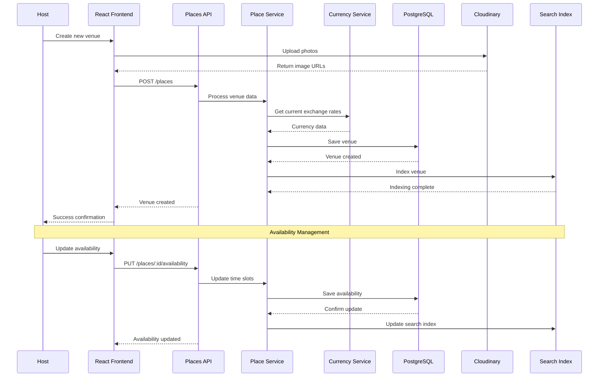
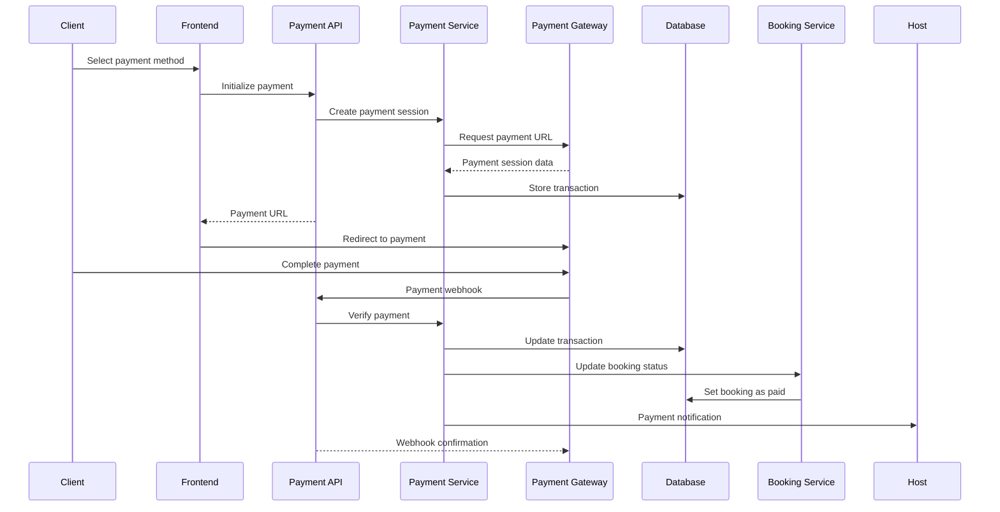
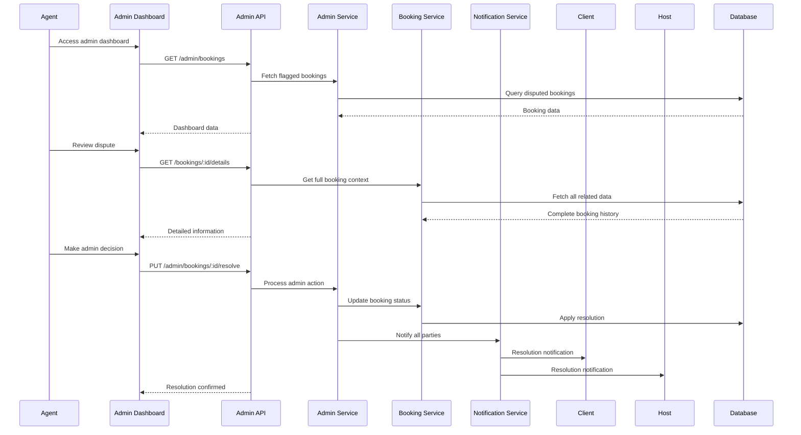

# GetSpace - Professional Venue Booking Platform

## Project Vision & Intent

**GetSpace** is a revolutionary venue booking platform that transforms how businesses find and book professional spaces. Built as a comprehensive, production-ready application, GetSpace demonstrates advanced full-stack development capabilities with enterprise-grade features including real-time availability management, sophisticated booking workflows, payment integration readiness, role-based access control, and comprehensive audit trails.

### Platform Differentiators

🏢 **Business-Focused**: Unlike general rental platforms, GetSpace specializes in professional venues with business-specific amenities and booking patterns

⏰ **Hourly Precision**: Advanced time-slot management with conflict detection, cooldown periods, and flexible scheduling

💼 **Multi-Role Architecture**: Sophisticated role management (Clients, Hosts, Agents) with tailored workflows for each user type

🔒 **Enterprise Security**: JWT-based authentication, role-based access control, and comprehensive audit logging

💳 **Payment Ready**: Integrated payment gateway preparation with support for multiple Uzbekistan payment providers

📊 **Advanced Analytics**: Booking insights, revenue tracking, and performance metrics for hosts

🛡️ **Protection Plans**: Optional client protection insurance with dynamic pricing

### Technical Excellence

This platform showcases production-ready development practices including:
- **Microservice-Ready Architecture**: Modular backend services with clear separation of concerns
- **Real-Time Conflict Resolution**: Advanced booking validation with time-slot conflict detection
- **Dynamic Pricing**: Currency exchange integration and flexible pricing models
- **Comprehensive Testing**: error handling
- **Production Deployment**: cloud deployment ready with Render
- **Performance Optimization**: Database indexing, query optimization, and caching strategies

## System Architecture Overview

GetSpace employs a modern, scalable architecture designed for enterprise-level performance and maintainability.



## Core Platform Features

### 🏢 Venue Management System
- **Advanced Venue Listings**: Rich venue profiles with multiple photos, detailed amenities, and virtual tours
- **Dynamic Pricing**: Multi-currency support with real-time exchange rates
- **Availability Management**: Complex time-slot scheduling with automated conflict resolution
- **Venue Analytics**: Performance metrics, booking trends, and revenue insights

### 📅 Intelligent Booking Engine
- **Real-Time Availability**: Live availability checking with pessimistic locking
- **Conflict Resolution**: Advanced algorithm preventing double-bookings with cooldown periods
- **Flexible Scheduling**: Hourly bookings, full-day rates, and minimum booking requirements
- **Booking Workflow**: Multi-stage approval process (Pending → Selected → Approved → Completed)

### 👥 Multi-Role User Management
- **Clients**: Browse, book, and manage reservations with payment tracking
- **Hosts**: Manage venues, approve bookings, track revenue, and handle guest communications
- **Agents**: Administrative oversight, dispute resolution, and platform management

### 💳 Payment Processing Framework
- **Multi-Gateway Support**: Integration-ready for Click, Payme, and Octo payment systems
- **Transaction Tracking**: Comprehensive payment audit trails and reconciliation
- **Protection Plans**: Optional client insurance with dynamic fee calculation
- **Revenue Analytics**: Real-time financial reporting and payout management

### 🔐 Enterprise Security
- **JWT Authentication**: Secure token-based authentication with refresh token rotation
- **Role-Based Access Control**: Granular permissions system with resource-level security
- **Audit Logging**: Comprehensive activity tracking for compliance and debugging
- **Data Protection**: Encrypted sensitive data storage and GDPR compliance readiness

### 📊 Advanced Booking Intelligence
- **Conflict Detection**: Sophisticated algorithm preventing scheduling conflicts
- **Capacity Management**: Dynamic venue capacity tracking and optimization
- **Booking Analytics**: Predictive analytics for demand forecasting
- **Automated Workflows**: Smart notifications and status update automation

## Database Architecture & Data Models



### Advanced Database Features

- **Indexing Strategy**: Optimized indexes for search, filtering, and time-slot queries
- **Data Integrity**: Foreign key constraints, check constraints, and trigger validations
- **Audit Trails**: Comprehensive change tracking with temporal data storage
- **Performance**: Connection pooling, query optimization, and read replicas ready
- **Migration System**: Version-controlled schema changes with rollback capability

## Frontend Architecture



### Frontend Technology Stack

- **React 18**: Latest React with concurrent features and improved performance
- **Vite**: Lightning-fast development server and optimized production builds
- **Tailwind CSS**: Utility-first CSS framework with custom design system
- **React Query**: Server state management with caching and synchronization
- **React Hook Form**: Performant forms with built-in validation
- **React Router v6**: Type-safe routing with nested layouts
- **Cloudinary**: Optimized image handling with transformations



## Backend Service Architecture

```mermaid
graph TB
    subgraph "API Gateway Layer"
        ExpressApp[Express.js Application]
        AuthMiddleware[JWT Authentication]
        CORSMiddleware[CORS Configuration]
        RateLimiter[Rate Limiting]
        ErrorHandler[Global Error Handler]
    end
    
    subgraph "Business Logic Services"
        AuthService[Authentication Service]
        BookingService[Booking Management Service]
        PlaceService[Venue Management Service]
        UserService[User Management Service]
        PaymentService[Payment Processing Service]
        NotificationService[Notification Service]
        CurrencyService[Currency Exchange Service]
        RefundService[Refund Policy Service]
    end
    
    subgraph "Data Access Layer"
        UserModel[User Model]
        PlaceModel[Place Model]
        BookingModel[Booking Model]
        CurrencyModel[Currency Model]
        SequelizeORM[Sequelize ORM]
    end
    
    subgraph "External Services"
        PostgreSQL[(PostgreSQL Database)]
        CloudinaryAPI[Cloudinary CDN]
        EmailService[Email Provider]
        TelegramAPI[Telegram Bot API]
        PaymentAPIs[Payment Gateways]
        CurrencyAPI[Exchange Rate API]
    end
    
    ExpressApp --> AuthMiddleware
    ExpressApp --> BusinessLogicServices
    BusinessLogicServices --> DataAccessLayer
    DataAccessLayer --> SequelizeORM
    SequelizeORM --> PostgreSQL
    
    BookingService --> PaymentAPIs
    PlaceService --> CloudinaryAPI
    NotificationService --> EmailService
    NotificationService --> TelegramAPI
    CurrencyService --> CurrencyAPI
    
    classDef gatewayLayer fill:#e1f5fe,stroke:#0277bd,stroke-width:2px
    classDef businessLayer fill:#f3e5f5,stroke:#7b1fa2,stroke-width:2px
    classDef dataLayer fill:#e8f5e8,stroke:#2e7d32,stroke-width:2px
    classDef externalLayer fill:#fff8e1,stroke:#f57c00,stroke-width:2px
    
    class ExpressApp,AuthMiddleware,CORSMiddleware,RateLimiter,ErrorHandler gatewayLayer
    class AuthService,BookingService,PlaceService,UserService,PaymentService,NotificationService,CurrencyService,RefundService businessLayer
    class UserModel,PlaceModel,BookingModel,CurrencyModel,SequelizeORM dataLayer
    class PostgreSQL,CloudinaryAPI,EmailService,TelegramAPI,PaymentAPIs,CurrencyAPI externalLayer
```



### Backend Technology Stack

- **Node.js**: High-performance JavaScript runtime with non-blocking I/O
- **Express.js**: Minimal and flexible web application framework
- **Sequelize ORM**: Feature-rich ORM with migrations and validations
- **PostgreSQL**: Advanced relational database with ACID compliance
- **JWT**: Stateless authentication with secure token management
- **Cloudinary**: Cloud-based image and video management
- **Docker**: Containerization for consistent deployment environments

## Critical Business Workflows

### 1. Advanced Booking Process with Conflict Resolution



### 2. Venue Management with Real-Time Availability



### 3. Payment Processing Workflow



### 4. Agent Management & Dispute Resolution



## Key Technical Innovations

### 1. Advanced Conflict Resolution Engine
- **Pessimistic Locking**: Prevents race conditions during booking creation
- **Cooldown Periods**: Automatic buffer time between bookings
- **Real-Time Validation**: Live availability checking with immediate feedback
- **Atomic Transactions**: Database-level consistency for booking operations

### 2. Dynamic Pricing & Currency Management
- **Multi-Currency Support**: Real-time exchange rate integration
- **Flexible Pricing Models**: Hourly rates, full-day discounts, minimum hours
- **Protection Plan Pricing**: Dynamic fee calculation based on booking value
- **Regional Payment Methods**: Integration with Uzbekistan's top payment providers

### 3. Intelligent Notification System
- **Multi-Channel Delivery**: Email, in-app, and Telegram notifications
- **Smart Routing**: Role-based notification preferences
- **Delivery Confirmation**: Webhook-based delivery tracking
- **Template Management**: Localized, branded communication templates

### 4. Comprehensive Audit & Compliance
- **Booking Snapshots**: Immutable records of terms at booking time
- **Change Tracking**: Complete audit trail for all modifications
- **Refund Policy Versioning**: Historical policy preservation for legal compliance
- **Transaction Logging**: Comprehensive financial audit trails

## Production-Ready Features & Deployment

### 🚀 DevOps & Infrastructure
- **CI/CD Pipeline**: Automated testing, building, and deployment
- **Database Migrations**: Version-controlled schema evolution with rollback capability
- **Monitoring & Logging**: Application performance monitoring and centralized logging

### 🔧 Performance Optimization
- **Database Optimization**: Intelligent indexing and query optimization
- **CDN Integration**: Global content delivery with Cloudinary
- **Caching Strategy**: Multi-layer caching (Redis, browser, CDN)
- **Bundle Optimization**: Code splitting and lazy loading
- **Image Optimization**: Automatic compression and responsive delivery

### 🛡️ Security Implementation
- **JWT Security**: Secure token handling with refresh rotation
- **Data Validation**: Comprehensive input sanitization and validation
- **HTTPS Enforcement**: End-to-end encryption in production
- **Rate Limiting**: API protection against abuse and DDoS
- **CORS Configuration**: Secure cross-origin resource sharing

### 📊 Business Intelligence
- **Revenue Analytics**: Real-time financial reporting and forecasting (pending in future releases)
- **Booking Insights**: Occupancy rates, peak times, and demand patterns (pending in future releases)
- **User Behavior**: Client journey analysis and conversion optimization
- **Performance Metrics**: System health and business KPI monitoring

## Technology Stack Summary

### Frontend Excellence
```
React 18 + Vite + Common JSX
├── UI Framework: Tailwind CSS + Custom Components
├── State Management: React Query + Context API  
├── Routing: React Router v6 with Protected Routes
├── Forms: React Hook Form + Zod Validation
├── Testing: Jest + React Testing Library
└── Build: Vite with ESBuild optimization
```

### Backend Robustness
```
Node.js + Express.js + Common JSX
├── Database: PostgreSQL + Sequelize ORM
├── Authentication: JWT + Role-based Access Control
├── File Storage: Cloudinary CDN Integration
├── Payment: Multi-gateway support (Click, Payme, Octo)
├── Notifications: Email + Telegram Bot integration (pendind in future releases)
```

### Infrastructure & DevOps
```
Production Deployment
├── Containerization: Docker + Docker Compose
├── Cloud Platform: Render.com ready deployment
├── Database: PostgreSQL with connection pooling
├── Monitoring: Application performance monitoring
├── Security: HTTPS, JWT, input validation
└── Scalability: Horizontal scaling ready
```

## Competitive Advantages

### 1. **Technical Sophistication**
- Production-grade architecture with enterprise patterns
- Advanced conflict resolution algorithms
- Real-time availability management
- Comprehensive audit trails and compliance features

### 2. **Business Innovation**
- Specialized venue booking focus vs. general rental platforms
- Multi-currency support with real-time exchange rates
- Flexible protection plans with dynamic pricing
- Agent-mediated dispute resolution system

### 3. **User Experience Excellence**
- Intuitive, mobile-first responsive design
- Real-time availability feedback
- Streamlined booking workflow
- Comprehensive booking management dashboard

### 4. **Market Readiness**
- Integration with local payment systems (Uzbekistan focus)
- Multi-language support ready
- Scalable architecture for rapid growth
- Compliance-ready audit trails

---

**GetSpace** represents a complete, production-ready solution that demonstrates advanced full-stack development capabilities while solving real business problems in the professional venue booking market. The platform showcases enterprise-grade architecture, sophisticated business logic, and production-ready deployment practices that set it apart from typical demonstration projects.