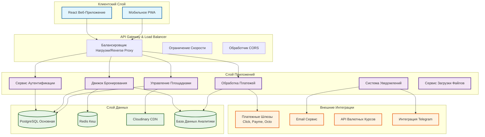
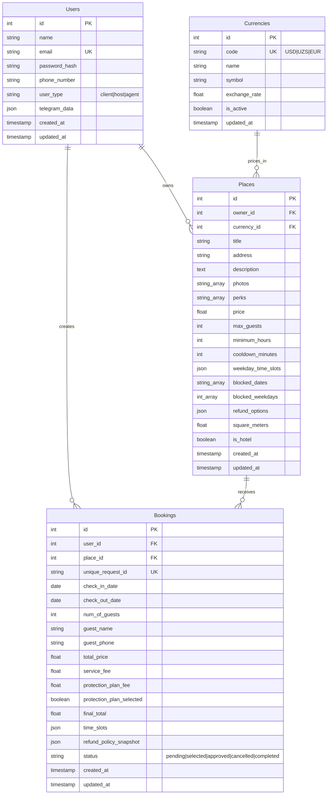
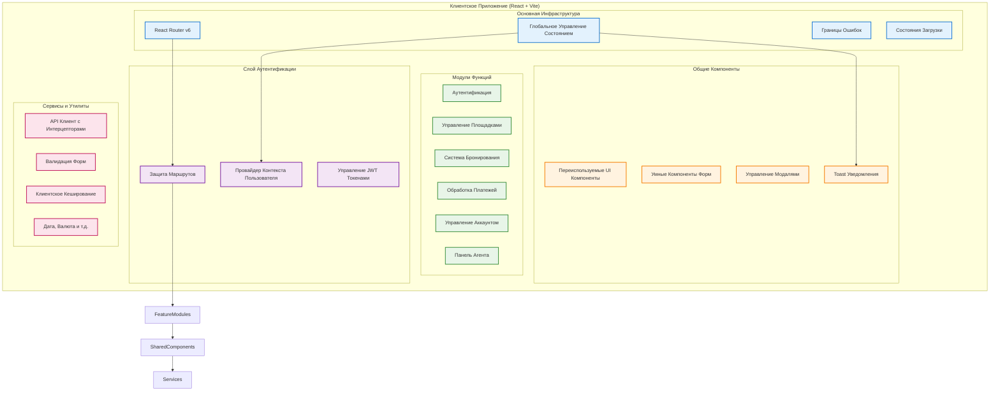
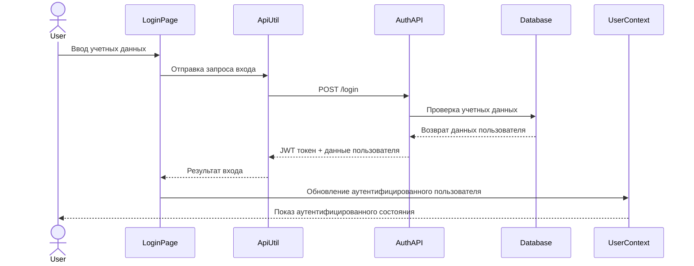
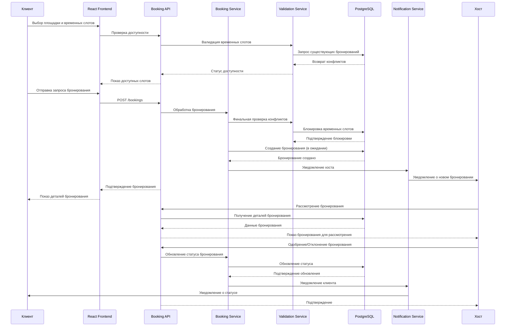
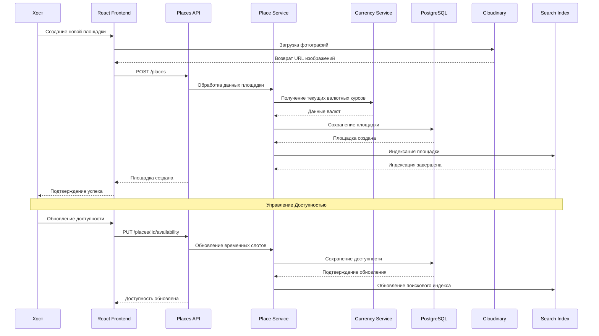
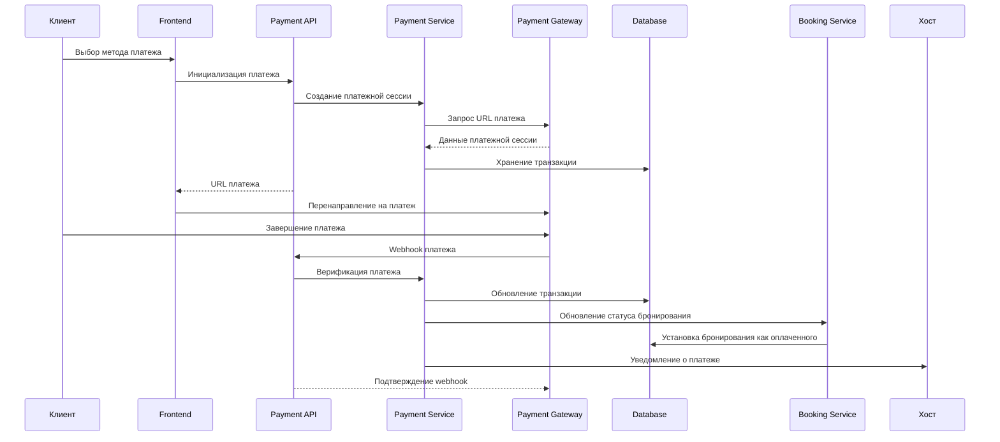
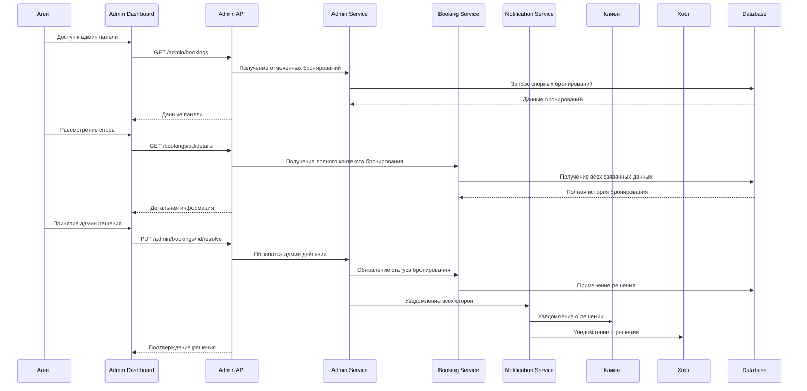

# GetSpace - Платформа для Бронирования Профессиональных Площадок

## Видение и Цель Проекта

**GetSpace** — это платформа для бронирования площадок, которая трансформирует то, как бизнес находит и бронирует профессиональные пространства. Построенная как комплексное, готовое к производству приложение, GetSpace демонстрирует передовые возможности full-stack разработки с функциями корпоративного уровня, включая управление доступностью в реальном времени, сложные рабочие процессы бронирования, готовность к интеграции платежей, контроль доступа на основе ролей и комплексные журналы аудита.

### Отличительные Особенности Платформы

🏢 **Ориентированность на Бизнес**: В отличие от общих платформ аренды, GetSpace специализируется на профессиональных площадках с бизнес-специфичными удобствами и паттернами бронирования

⏰ **Почасовая Точность**: Продвинутое управление временными слотами с обнаружением конфликтов, периодами ожидания и гибким планированием

💼 **Мультиролевая Архитектура**: Сложное управление ролями (Клиенты, Хосты, Агенты) с адаптированными рабочими процессами для каждого типа пользователей

🔒 **Корпоративная Безопасность**: JWT-аутентификация, контроль доступа на основе ролей и комплексное ведение журналов аудита

💳 **Готовность к Платежам**: Интегрированная подготовка платежных шлюзов с поддержкой нескольких узбекских платежных провайдеров

📊 **Продвинутая Аналитика**: Аналитика бронирований, отслеживание доходов и метрики производительности для хостов

🛡️ **Планы Защиты**: Дополнительная страховка защиты клиентов с динамическим ценообразованием

### Техническое Совершенство

Данная платформа демонстрирует готовые к производству практики разработки, включая:
- **Микросервисно-Готовая Архитектура**: Модульные backend сервисы с четким разделением ответственности
- **Разрешение Конфликтов в Реальном Времени**: Продвинутая валидация бронирований с обнаружением конфликтов временных слотов
- **Динамическое Ценообразование**: Интеграция валютных курсов и гибкие модели ценообразования
- **Комплексное Тестирование**: Обработка ошибок
- **Развертывание в Производстве**: Готовое к развертыванию в облаке с Render
- **Оптимизация Производительности**: Индексация базы данных, оптимизация запросов и стратегии кеширования

## Обзор Системной Архитектуры

GetSpace использует современную, масштабируемую архитектуру, разработанную для производительности и сопровождаемости корпоративного уровня.



## Основные Функции Платформы

### 🏢 Система Управления Площадками
- **Продвинутые Объявления Площадок**: Богатые профили площадок с множественными фотографиями, детальными удобствами и виртуальными турами
- **Динамическое Ценообразование**: Поддержка мультивалют с курсами в реальном времени
- **Управление Доступностью**: Сложное планирование временных слотов с автоматизированным разрешением конфликтов
- **Аналитика Площадок**: Метрики производительности, тренды бронирований и аналитика доходов

### 📅 Интеллектуальный Движок Бронирования
- **Доступность в Реальном Времени**: Проверка доступности в реальном времени с пессимистичной блокировкой
- **Разрешение Конфликтов**: Продвинутый алгоритм предотвращения двойных бронирований с периодами ожидания
- **Гибкое Планирование**: Почасовые бронирования, полнодневные тарифы и минимальные требования к бронированию
- **Рабочий Процесс Бронирования**: Многоэтапный процесс одобрения (В ожидании → Выбрано → Одобрено → Завершено)

### 👥 Мультиролевое Управление Пользователями
- **Клиенты**: Просмотр, бронирование и управление резервациями с отслеживанием платежей
- **Хосты**: Управление площадками, одобрение бронирований, отслеживание доходов и обработка коммуникаций с гостями
- **Агенты**: Административный надзор, разрешение споров и управление платформой

### 💳 Фреймворк Обработки Платежей
- **Поддержка Множественных Шлюзов**: Готовность к интеграции с платежными системами Click, Payme и Octo
- **Отслеживание Транзакций**: Комплексные журналы аудита платежей и сверка
- **Планы Защиты**: Дополнительная страховка клиентов с динамическим расчетом комиссий
- **Аналитика Доходов**: Финансовая отчетность в реальном времени и управление выплатами

### 🔐 Корпоративная Безопасность
- **JWT Аутентификация**: Безопасная токен-аутентификация с ротацией refresh токенов
- **Контроль Доступа на Основе Ролей**: Детализированная система разрешений с безопасностью на уровне ресурсов
- **Журналирование Аудита**: Комплексное отслеживание активности для соответствия требованиям и отладки
- **Защита Данных**: Зашифрованное хранение чувствительных данных и готовность к соответствию GDPR

### 📊 Продвинутая Интеллектуальная Система Бронирования
- **Обнаружение Конфликтов**: Сложный алгоритм предотвращения конфликтов планирования
- **Управление Пропускной Способностью**: Динамическое отслеживание и оптимизация вместимости площадок
- **Аналитика Бронирований**: Предиктивная аналитика для прогнозирования спроса
- **Автоматизированные Рабочие Процессы**: Умные уведомления и автоматизация обновления статусов

## Архитектура База Данных и Модели Данных



### Продвинутые Функции База Данных

- **Стратегия Индексации**: Оптимизированные индексы для поиска, фильтрации и запросов временных слотов
- **Целостность Данных**: Ограничения внешних ключей, проверочные ограничения и триггерные валидации
- **Журналы Аудита**: Комплексное отслеживание изменений с временным хранением данных
- **Производительность**: Пулинг соединений, оптимизация запросов и готовность к репликам для чтения
- **Система Миграций**: Версионированные изменения схемы с возможностью отката

## Архитектура Frontend



### Технологический Стек Frontend

- **React 18**: Последний React с функциями конкурентности и улучшенной производительностью
- **Vite**: Молниеносный сервер разработки и оптимизированные production сборки
- **Tailwind CSS**: Utility-first CSS фреймворк с кастомной дизайн-системой
- **React Query**: Управление состоянием сервера с кешированием и синхронизацией
- **React Hook Form**: Производительные формы с встроенной валидацией
- **React Router v6**: Типобезопасная маршрутизация с вложенными макетами
- **Cloudinary**: Оптимизированная обработка изображений с трансформациями



## Архитектура Backend Сервисов

```mermaid
graph TB
    subgraph "Слой API Gateway"
        ExpressApp[Express.js Приложение]
        AuthMiddleware[JWT Аутентификация]
        CORSMiddleware[CORS Конфигурация]
        RateLimiter[Ограничение Скорости]
        ErrorHandler[Глобальный Обработчик Ошибок]
    end
    
    subgraph "Сервисы Бизнес-Логики"
        AuthService[Сервис Аутентификации]
        BookingService[Сервис Управления Бронированием]
        PlaceService[Сервис Управления Площадками]
        UserService[Сервис Управления Пользователями]
        PaymentService[Сервис Обработки Платежей]
        NotificationService[Сервис Уведомлений]
        CurrencyService[Сервис Валютных Курсов]
        RefundService[Сервис Политики Возврата]
    end
    
    subgraph "Слой Доступа к Данным"
        UserModel[Модель Пользователя]
        PlaceModel[Модель Площадки]
        BookingModel[Модель Бронирования]
        CurrencyModel[Модель Валюты]
        SequelizeORM[Sequelize ORM]
    end
    
    subgraph "Внешние Сервисы"
        PostgreSQL[(База Данных PostgreSQL)]
        CloudinaryAPI[Cloudinary CDN]
        EmailService[Провайдер Email]
        TelegramAPI[API Telegram Бота]
        PaymentAPIs[Платежные Шлюзы]
        CurrencyAPI[API Валютных Курсов]
    end
    
    ExpressApp --> AuthMiddleware
    ExpressApp --> BusinessLogicServices
    BusinessLogicServices --> DataAccessLayer
    DataAccessLayer --> SequelizeORM
    SequelizeORM --> PostgreSQL
    
    BookingService --> PaymentAPIs
    PlaceService --> CloudinaryAPI
    NotificationService --> EmailService
    NotificationService --> TelegramAPI
    CurrencyService --> CurrencyAPI
    
    classDef gatewayLayer fill:#e1f5fe,stroke:#0277bd,stroke-width:2px
    classDef businessLayer fill:#f3e5f5,stroke:#7b1fa2,stroke-width:2px
    classDef dataLayer fill:#e8f5e8,stroke:#2e7d32,stroke-width:2px
    classDef externalLayer fill:#fff8e1,stroke:#f57c00,stroke-width:2px
    
    class ExpressApp,AuthMiddleware,CORSMiddleware,RateLimiter,ErrorHandler gatewayLayer
    class AuthService,BookingService,PlaceService,UserService,PaymentService,NotificationService,CurrencyService,RefundService businessLayer
    class UserModel,PlaceModel,BookingModel,CurrencyModel,SequelizeORM dataLayer
    class PostgreSQL,CloudinaryAPI,EmailService,TelegramAPI,PaymentAPIs,CurrencyAPI externalLayer
```



### Технологический Стек Backend

- **Node.js**: Высокопроизводительная JavaScript среда выполнения с неблокирующим I/O
- **Express.js**: Минималистичный и гибкий фреймворк веб-приложений
- **Sequelize ORM**: Многофункциональная ORM с миграциями и валидациями
- **PostgreSQL**: Продвинутая реляционная база данных с ACID соответствием
- **JWT**: Stateless аутентификация с безопасным управлением токенами
- **Cloudinary**: Облачное управление изображениями и видео
- **Docker**: Контейнеризация для консистентных сред развертывания

## Критические Бизнес-Процессы

### 1. Продвинутый Процесс Бронирования с Разрешением Конфликтов



### 2. Управление Площадками с Доступностью в Реальном Времени



### 3. Рабочий Процесс Обработки Платежей



### 4. Управление Агентами и Разрешение Споров



## Ключевые Технические Инновации

### 1. Продвинутый Движок Разрешения Конфликтов
- **Пессимистичная Блокировка**: Предотвращает состояния гонки при создании бронирований
- **Периоды Ожидания**: Автоматическое буферное время между бронированиями
- **Валидация в Реальном Времени**: Проверка доступности в реальном времени с немедленной обратной связью
- **Атомарные Транзакции**: Консистентность на уровне базы данных для операций бронирования

### 2. Динамическое Ценообразование и Управление Валютами
- **Поддержка Мультивалют**: Интеграция валютных курсов в реальном времени
- **Гибкие Модели Ценообразования**: Почасовые тарифы, полнодневные скидки, минимальные часы
- **Ценообразование Планов Защиты**: Динамический расчет комиссий на основе стоимости бронирования
- **Региональные Платежные Методы**: Интеграция с топовыми платежными провайдерами Узбекистана

### 3. Интеллектуальная Система Уведомлений
- **Многоканальная Доставка**: Email, внутриприложенческие и Telegram уведомления
- **Умная Маршрутизация**: Предпочтения уведомлений на основе ролей
- **Подтверждение Доставки**: Отслеживание доставки на основе webhook
- **Управление Шаблонами**: Локализованные, брендированные коммуникационные шаблоны

### 4. Комплексный Аудит и Соответствие Требованиям
- **Снимки Бронирований**: Неизменяемые записи условий на момент бронирования
- **Отслеживание Изменений**: Полный аудит-трейл для всех модификаций
- **Версионирование Политики Возврата**: Историческое сохранение политик для правового соответствия
- **Логирование Транзакций**: Комплексные финансовые аудит-трейлы

## Готовые к Производству Функции и Развертывание

### 🚀 DevOps и Инфраструктура
- **CI/CD Pipeline**: Автоматизированное тестирование, сборка и развертывание
- **Миграции База Данных**: Версионированная эволюция схемы с возможностью отката
- **Мониторинг и Логирование**: Мониторинг производительности приложений и централизованное логирование

### 🔧 Оптимизация Производительности
- **Оптимизация База Данных**: Интеллектуальная индексация и оптимизация запросов
- **Интеграция CDN**: Глобальная доставка контента с Cloudinary
- **Стратегия Кеширования**: Многослойное кеширование (Redis, браузер, CDN)
- **Оптимизация Бандла**: Разделение кода и ленивая загрузка
- **Оптимизация Изображений**: Автоматическое сжатие и адаптивная доставка

### 🛡️ Реализация Безопасности
- **JWT Безопасность**: Безопасная обработка токенов с ротацией refresh
- **Валидация Данных**: Комплексная санитизация и валидация входных данных
- **Принуждение HTTPS**: End-to-end шифрование в производстве
- **Ограничение Скорости**: Защита API от злоупотреблений и DDoS
- **Конфигурация CORS**: Безопасное совместное использование ресурсов между источниками

### 📊 Бизнес-Аналитика
- **Аналитика Доходов**: Финансовая отчетность и прогнозирование в реальном времени (в ожидании в будущих релизах)
- **Аналитика Бронирований**: Показатели занятости, пиковые времена и паттерны спроса (в ожидании в будущих релизах)
- **Поведение Пользователей**: Анализ пути клиентов и оптимизация конверсии
- **Метрики Производительности**: Мониторинг здоровья системы и бизнес-KPI

## Сводка Технологического Стека

### Превосходство Frontend
```
React 18 + Vite + Common JSX
├── UI Framework: Tailwind CSS + Кастомные Компоненты
├── Управление Состоянием: React Query + Context API  
├── Маршрутизация: React Router v6 с Защищенными Маршрутами
├── Формы: React Hook Form + Zod Валидация
├── Тестирование: Jest + React Testing Library
└── Сборка: Vite с оптимизацией ESBuild
```

### Надежность Backend
```
Node.js + Express.js + Common JSX
├── База Данных: PostgreSQL + Sequelize ORM
├── Аутентификация: JWT + Контроль Доступа на Основе Ролей
├── Хранение Файлов: Интеграция Cloudinary CDN
├── Платежи: Поддержка множественных шлюзов (Click, Payme, Octo)
├── Уведомления: Email + Интеграция Telegram Бота (в ожидании в будущих релизах)
```

### Инфраструктура и DevOps
```
Развертывание в Производстве
├── Контейнеризация: Docker + Docker Compose
├── Облачная Платформа: Готовое развертывание Render.com
├── База Данных: PostgreSQL с пулингом соединений
├── Мониторинг: Мониторинг производительности приложений
├── Безопасность: HTTPS, JWT, валидация входных данных
└── Масштабируемость: Готовность к горизонтальному масштабированию
```

## Конкурентные Преимущества

### 1. **Техническая Сложность**
- Архитектура production-grade с корпоративными паттернами
- Продвинутые алгоритмы разрешения конфликтов
- Управление доступностью в реальном времени
- Комплексные аудит-трейлы и функции соответствия требованиям

### 2. **Бизнес-Инновации**
- Специализированный фокус на бронировании площадок против общих платформ аренды
- Поддержка мультивалют с валютными курсами в реальном времени
- Гибкие планы защиты с динамическим ценообразованием
- Система разрешения споров через агентов

### 3. **Превосходство Пользовательского Опыта**
- Интуитивный, mobile-first адаптивный дизайн
- Обратная связь о доступности в реальном времени
- Упрощенный рабочий процесс бронирования
- Комплексная панель управления бронированиями

### 4. **Готовность к Рынку**
- Интеграция с местными платежными системами (фокус на Узбекистан)
- Готовность к поддержке множественных языков
- Масштабируемая архитектура для быстрого роста
- Готовые к соответствию требованиям аудит-трейлы

---

**GetSpace** представляет собой полное, готовое к производству решение, которое демонстрирует продвинутые возможности full-stack разработки, решая при этом реальные бизнес-проблемы на рынке бронирования профессиональных площадок. Платформа демонстрирует архитектуру корпоративного уровня, сложную бизнес-логику и готовые к производству практики развертывания, которые выделяют её среди типичных демонстрационных проектов.
