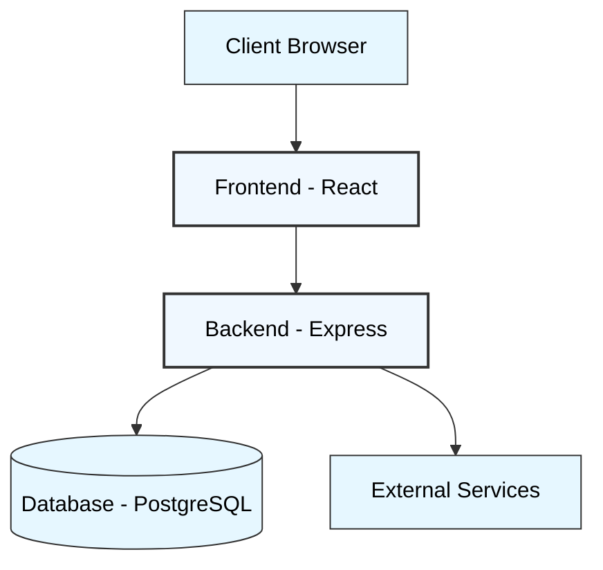
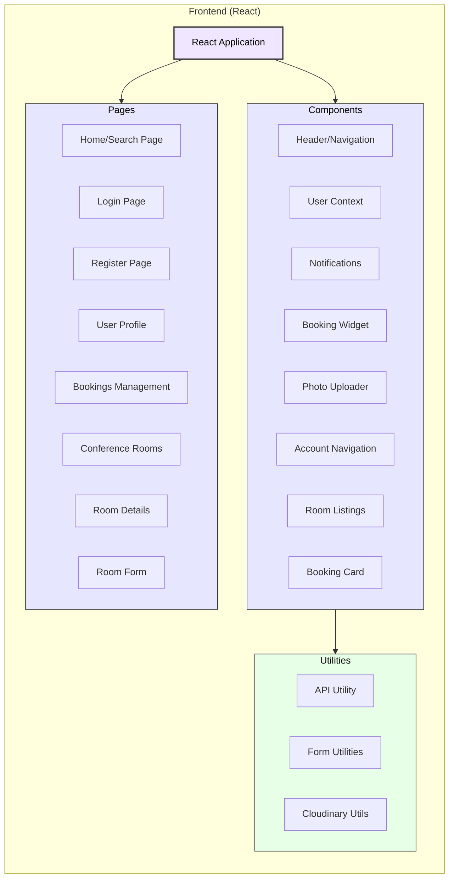
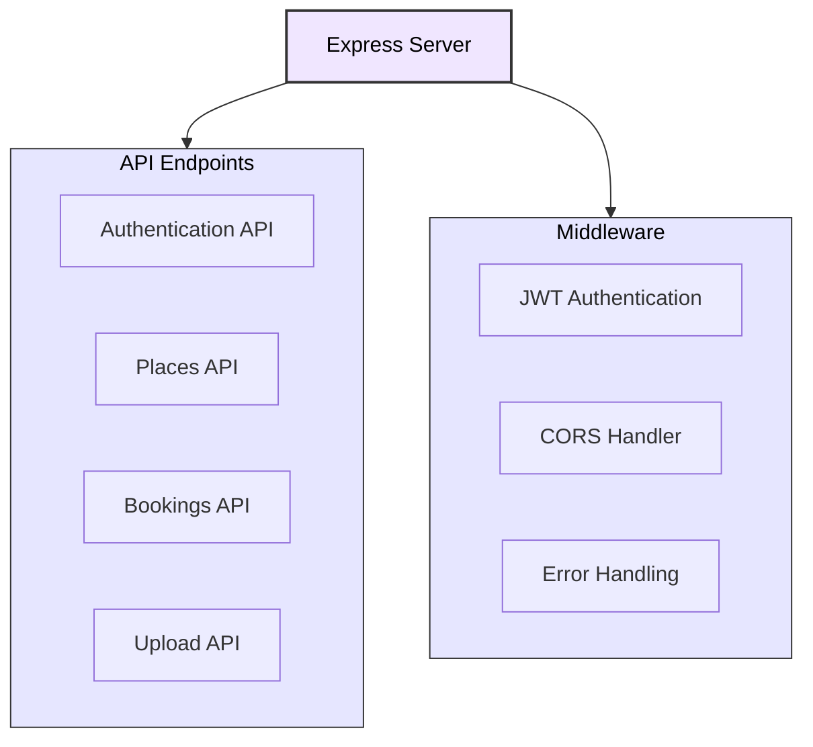
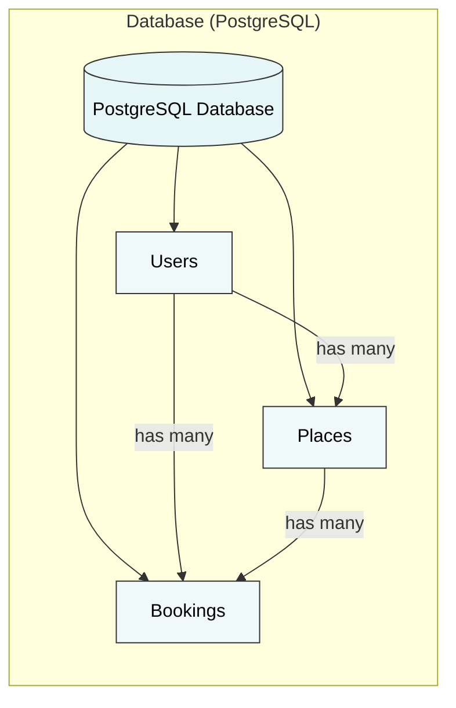
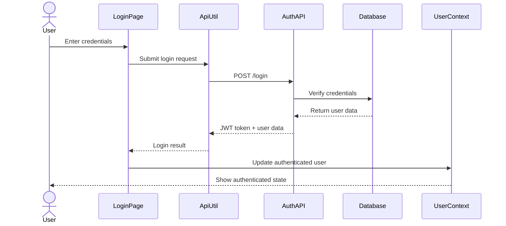
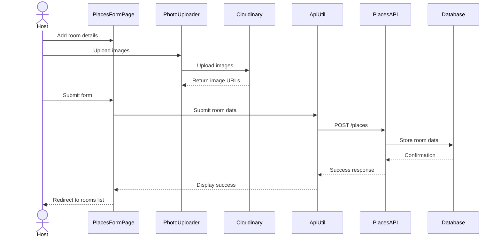
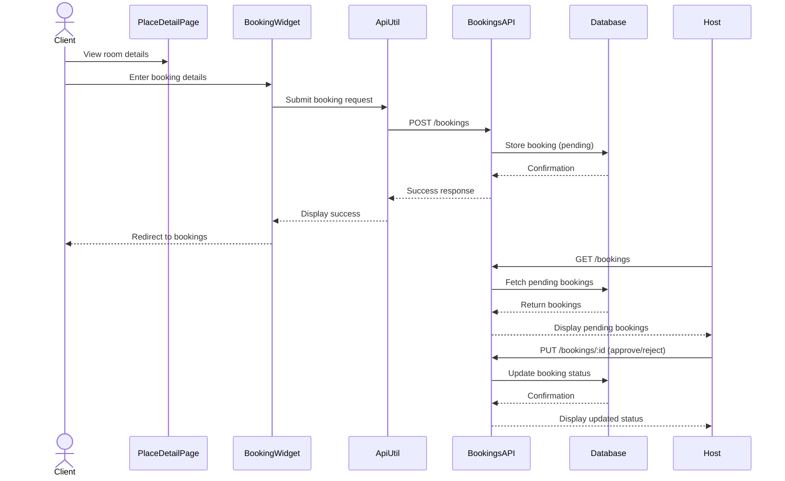

# ConferenceHub - Application Architecture

## Project Overview

ConferenceHub is a comprehensive platform designed to streamline the process of booking and managing conference spaces. Similar to how Airbnb revolutionized accommodation rentals, ConferenceHub focuses specifically on meeting and conference room bookings for business purposes. The application connects space hosts with clients needing professional meeting environments. Hosts can list their conference rooms with detailed information, while clients can easily search, view, and book these spaces based on their requirements. The platform handles the entire booking process, from discovery to confirmation, and includes a review and approval system for hosts to manage incoming booking requests.

This document provides a comprehensive overview of the ConferenceHub application architecture, including how data flows through the system and the relationships between different components.

## High-Level System Overview

## Frontend Architecture

## Backend Architecture

## Database Models

## Authentication Flow

## Room Listing Process

## Booking Process

## Component Explanations

### Frontend (Client-Side)

#### Pages
- **IndexPage**: Main landing page displaying available conference rooms with search functionality
- **LoginPage/RegisterPage**: User authentication pages for clients and hosts
- **ProfilePage**: User profile management
- **BookingsPage**: For clients to see their bookings and for hosts to approve/reject booking requests
- **PlacesPage**: For hosts to manage their conference rooms
- **PlaceDetailPage**: Detailed view of a conference room with booking capability
- **PlacesFormPage**: Form for hosts to create/edit conference room listings

#### Components
- **Header**: Navigation bar with search functionality
- **UserContext**: React context for global user state management
- **NotificationContext**: Handles system notifications and alerts
- **BookingWidget**: Booking form for clients to reserve rooms
- **PhotoUploader**: Component for uploading and managing room images
- **AccountNav**: Navigation for account-related pages
- **List**: Reusable component for displaying room listings
- **BookingCard**: Display booking details with actions (approve/reject/cancel)

#### Utilities
- **ApiUtil**: Centralized API request handling with Axios
- **FormUtils**: Form validation and processing utilities
- **CloudinaryUtil**: Helper functions for Cloudinary image operations

### Backend (Server-Side)

#### API Endpoints
- **AuthAPI**: Handles user registration, login, and authentication
- **PlacesAPI**: Manages conference room listings (CRUD operations)
- **BookingsAPI**: Manages booking requests and status updates
- **UploadAPI**: Handles file uploads to Cloudinary

#### Middleware
- **JWT Authentication**: Verifies user identity with JSON Web Tokens
- **CORS Handler**: Manages cross-origin requests
- **Error Handling**: Standardized error responses

### Database (PostgreSQL)

#### Models
- **Users**: Stores user information with role-based access (host vs client)
- **Places**: Stores conference room details (title, address, photos, description, amenities, etc.)
- **Bookings**: Records booking requests with status tracking (pending, approved, rejected)

### External Services
- **Cloudinary**: Cloud-based image storage and delivery

## Role-Based Functionality

### Client Users
- Browse and search conference rooms
- View room details with photos and amenities
- Make booking requests
- Manage their bookings (view status, cancel)
- Update profile information

### Host Users
- All client capabilities
- Create and manage conference room listings
- Upload photos for their rooms
- Review and respond to booking requests
- View booking calendar and manage availability

## Technical Implementation Details

- **Frontend**: Built with React and Vite for fast development
- **Styling**: Tailwind CSS for responsive, mobile-first design
- **State Management**: React Context API for global state
- **API Communication**: Axios for HTTP requests
- **Backend**: Express.js RESTful API
- **Database**: PostgreSQL with Sequelize ORM
- **Authentication**: JWT-based authentication with HTTP-only cookies
- **Image Handling**: Cloudinary integration for cloud storage
- **Deployment**: Configured for Render.com using render.yaml