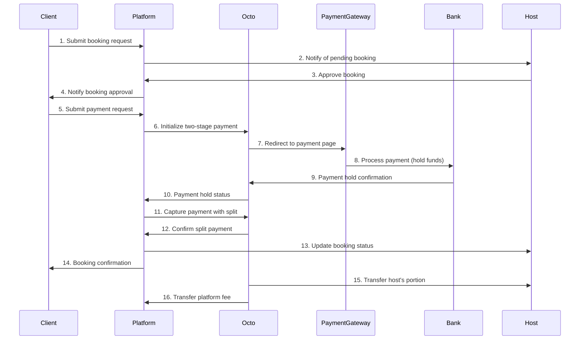

# Octo Payment Integration for ConferenceHub

## Complete Booking Flow with Payments

This document outlines the complete step-by-step booking flow with Octo payment integration for the ConferenceHub platform.

### For Hosts:

1. **Registration and Profile Setup**:
   - Host registers on the platform
   - Completes profile information

2. **Payment Setup**:
   - Host navigates to Account → Payment Settings
   - Enters Octo merchant ID
   - Provides bank account details
   - Enables online payments for their listings

3. **Create Conference Room Listings**:
   - Host adds conference room details (name, description, photos)
   - Sets pricing, availability, and maximum guests
   - Publishes the listing

4. **Manage Booking Requests**:
   - Host receives booking requests from clients
   - Reviews booking details (date, time, guest count)
   - Approves or rejects booking requests
   - For approved bookings, client proceeds to payment

5. **Receive Payments**:
   - Platform handles payment processing through Octo
   - Host receives notification when payment is completed
   - Platform transfers funds to host's bank account (minus platform fee)

### For Clients:

1. **Search and Browse**:
   - Client searches for conference rooms with filters
   - Views room details, photos, and availability

2. **Booking Request**:
   - Selects date, time, and number of guests
   - Enters personal details
   - Submits booking request

3. **Booking Approval**:
   - Client receives notification when host approves/rejects booking
   - Booking remains in "Pending" status until approved
   - If approved, proceeds to payment

4. **Payment Process**:
   - Clicks "Pay Now" button on approved booking
   - Redirected to Octo payment page
   - Selects payment method (card, etc.)
   - Completes payment
   - Redirected back to platform with success/failure status

5. **Booking Confirmation**:
   - If payment successful, booking status changes to "Confirmed"
   - Client receives booking confirmation with details
   - Can view all confirmed bookings in account dashboard

## Payment Processing Flow Diagram



## Octo API Implementation Details

### Two-Stage Payment Implementation

To implement the booking flow where payments only occur after host approval, we'll use Octo's two-stage payment process as documented:

1. **Booking Request Stage**:
   - When a client submits a booking request, it enters a "Pending" status
   - No payment is processed at this stage
   - Host receives notification to review and approve/reject

2. **Host Approval Stage**:
   - Host reviews and approves/rejects the booking request
   - If rejected, client is notified and no payment occurs
   - If approved, client receives notification to proceed with payment

3. **Payment Initiation Stage**:
   - Client clicks "Pay Now" on approved booking
   - Platform calls Octo API's `prepare_payment` method with `auto_capture = false`
   - This initializes a two-stage payment that holds funds without capturing immediately
   - Client is redirected to Octo payment page to complete payment

4. **Payment Hold Confirmation Stage**:
   - After successful payment, Octo holds the funds but doesn't capture them yet
   - Octo sends a callback to the platform to confirm the amount via the registered callback URL
   - The platform must respond to this callback to confirm the amount to be captured
   - According to the documentation, Octo will continue sending callbacks until a proper response is received

5. **Payment Capture Stage**:
   - Platform calls Octo's `set_accept` method with `accept_status = "capture"` to finalize the transaction
   - We must include `final_amount` parameter that matches the amount to be captured
   - This must be done within 30 minutes, or the transaction will be automatically canceled

### Payment Distribution Implementation

To distribute payments between the platform (agent fee) and host, we need to implement the payment distribution at the application level since the Octo documentation doesn't explicitly mention a built-in split payment feature:

1. **Processing the Full Payment**:
   - The platform captures the full payment amount from the client
   - This is done through the `set_accept` method with the full booking amount

2. **Distributing the Payment**:
   - After the payment is successfully captured, the platform must handle the distribution:
     - Record the platform fee portion in the database
     - Record the host's portion in the database
     - Implement a scheduled job or immediate transfer to send the host's portion to their account
   - This may involve using Octo's payout API or a manual process depending on Octo's capabilities

3. **API Implementation Code Example**:

```javascript
// Step 1: Initialize two-stage payment when booking is approved
const initializePayment = async (bookingId) => {
  try {
    const booking = await Booking.findById(bookingId).populate('place host');
    
    // Calculate amounts
    const totalAmount = booking.price * booking.numberOfNights;
    const platformFee = totalAmount * 0.10; // 10% platform fee
    const hostAmount = totalAmount - platformFee;
    
    // Call Octo API to prepare payment with auto_capture = false for two-stage payment
    const paymentData = {
      amount: totalAmount,
      auto_capture: false, // Enables two-stage payment as per Octo docs
      shop_transaction_id: booking._id.toString(), // Use booking ID as merchant transaction ID
      description: `Booking #${booking._id} for ${booking.place.title}`,
      return_url: `${process.env.APP_URL}/payment/success/${booking._id}`,
      cancel_url: `${process.env.APP_URL}/payment/cancel/${booking._id}`,
      callback_url: `${process.env.APP_URL}/api/payments/callback`, // URL to receive Octo callbacks
      metadata: {
        bookingId: booking._id.toString(),
        hostId: booking.host._id.toString(),
        placeId: booking.place._id.toString(),
        platformFee,
        hostAmount
      }
    };
    
    const response = await axios.post(
      `${process.env.OCTO_API_URL}/prepare_payment`,
      paymentData,
      {
        headers: {
          'Authorization': `Bearer ${process.env.OCTO_API_KEY}`,
          'Content-Type': 'application/json'
        }
      }
    );
    
    // Store payment reference in our database
    await Payment.create({
      booking: booking._id,
      transactionId: response.data.data.octo_payment_UUID, // Use Octo's payment UUID
      shopTransactionId: booking._id.toString(),
      amount: totalAmount,
      status: 'pending',
      platformFee,
      hostAmount,
      octoPayUrl: response.data.data.octo_pay_url
    });
    
    // Return payment URL to redirect client
    return response.data.data.octo_pay_url;
  } catch (error) {
    console.error('Payment initialization failed:', error);
    throw new Error('Failed to initialize payment');
  }
};

// Step 2: Handle Octo callback for payment confirmation
const handleOctoCallback = async (req, res) => {
  try {
    const { octo_secret, octo_payment_UUID, accept_status, final_amount } = req.body;
    
    // Verify the callback is legitimate using octo_secret
    if (octo_secret !== process.env.OCTO_SECRET) {
      console.error('Invalid Octo secret in callback');
      return res.status(403).json({ error: 'Invalid secret' });
    }
    
    // Find the payment in our database
    const payment = await Payment.findOne({ transactionId: octo_payment_UUID });
    
    if (!payment) {
      console.error(`Payment not found for transaction ID: ${octo_payment_UUID}`);
      return res.status(404).json({ error: 'Payment not found' });
    }
    
    // Update payment status based on callback
    if (accept_status === 'capture') {
      // Respond to confirm the amount to be captured
      payment.status = 'waiting_for_capture';
      await payment.save();
      
      // Return the confirmation response
      return res.json({
        accept_status: 'capture',
        final_amount: payment.amount
      });
    } else {
      // Handle cancellation or other statuses
      payment.status = 'cancelled';
      await payment.save();
      
      // Update booking status
      const booking = await Booking.findById(payment.booking);
      booking.status = 'cancelled';
      await booking.save();
      
      return res.json({
        accept_status: 'cancel'
      });
    }
  } catch (error) {
    console.error('Error handling Octo callback:', error);
    return res.status(500).json({ error: 'Internal server error' });
  }
};

// Step 3: Capture payment after successful hold and callback confirmation
const capturePayment = async (transactionId) => {
  try {
    const payment = await Payment.findOne({ transactionId }).populate({
      path: 'booking',
      populate: { path: 'host' }
    });
    
    if (!payment) {
      throw new Error('Payment not found');
    }
    
    if (payment.status !== 'waiting_for_capture') {
      throw new Error('Payment is not in waiting_for_capture status');
    }
    
    // Call Octo API to capture payment
    const captureData = {
      transaction_id: transactionId,
      accept_status: 'capture',
      final_amount: payment.amount
    };
    
    const response = await axios.post(
      `${process.env.OCTO_API_URL}/set_accept`,
      captureData,
      {
        headers: {
          'Authorization': `Bearer ${process.env.OCTO_API_KEY}`,
          'Content-Type': 'application/json'
        }
      }
    );
    
    // Update payment status in our database
    payment.status = 'completed';
    payment.capturedAt = new Date();
    await payment.save();
    
    // Update booking status
    const booking = payment.booking;
    booking.status = 'confirmed';
    await booking.save();
    
    // Handle platform fee and host payment distribution
    await processPaymentDistribution(payment);
    
    return { success: true, booking, payment };
  } catch (error) {
    console.error('Payment capture failed:', error);
    throw new Error('Failed to capture payment');
  }
};

// Step 4: Distribute payment between platform and host
const processPaymentDistribution = async (payment) => {
  try {
    // Record the distribution in the database
    await PaymentDistribution.create({
      payment: payment._id,
      platformAmount: payment.platformFee,
      hostAmount: payment.hostAmount,
      status: 'pending'
    });
    
    // In a real implementation, this would initiate transfers to host's account
    // This might be done through:
    // 1. A separate Octo API call for payout to host
    // 2. A manual bank transfer process
    // 3. An internal ledger system that gets settled periodically
    
    // For now, we'll just mark the distribution as completed
    // In a production system, this would be updated when actual transfers complete
    await PaymentDistribution.findOneAndUpdate(
      { payment: payment._id },
      { status: 'completed', processedAt: new Date() }
    );
    
    // Notify the host about the payment
    // sendPaymentNotification(payment.booking.host._id, payment);
    
    return true;
  } catch (error) {
    console.error('Payment distribution failed:', error);
    throw new Error('Failed to distribute payment');
  }
};
```

### Callback Handling

According to the Octo documentation, a callback will be sent from their system until they receive a confirmation response. Our implementation must:

1. Set up a secure endpoint to receive these callbacks
2. Verify the `octo_secret` from the callback to ensure it's legitimate
3. Respond with the confirmation structure specified in the documentation:
   ```json
   { "accept_status": "capture", "final_amount": 1000.00 }
   ```

The documentation states that if a transaction amount is not confirmed within 30 minutes, it will be automatically canceled. Our implementation must ensure that we handle the callbacks promptly and initiate the `set_accept` call within this timeframe.

### Transaction Status Tracking

We need to implement proper status tracking for both bookings and payments:

1. Booking Statuses:
   - `pending`: Initial status when client requests a booking
   - `approved`: Status after host approves the booking
   - `rejected`: Status if host rejects the booking
   - `payment_pending`: Status when client initiates payment
   - `payment_processing`: Status during payment processing
   - `confirmed`: Status after successful payment
   - `cancelled`: Status if payment is cancelled or failed

2. Payment Statuses:
   - `pending`: Initial status when payment is created
   - `processing`: Status during payment processing
   - `waiting_for_capture`: Status after Octo confirms the hold
   - `completed`: Status after successful capture
   - `failed`: Status if payment fails
   - `cancelled`: Status if payment is cancelled

By implementing these statuses, we can accurately track the state of each booking and payment throughout the process.