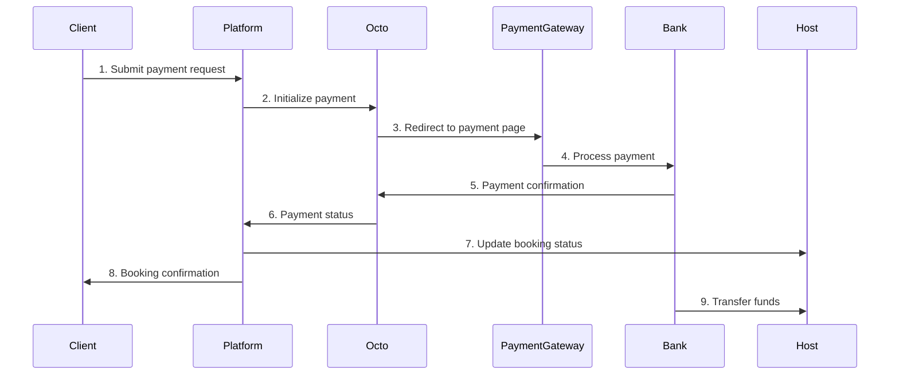

# Octo Payment Integration for ConferenceHub

## Complete Booking Flow with Payments

This document outlines the complete step-by-step booking flow with Octo payment integration for the ConferenceHub platform.

### For Hosts:

1. **Registration and Profile Setup**:
   - Host registers on the platform
   - Completes profile information

2. **Payment Setup**:
   - Host navigates to Account → Payment Settings
   - Enters Octo merchant ID
   - Provides bank account details
   - Enables online payments for their listings

3. **Create Conference Room Listings**:
   - Host adds conference room details (name, description, photos)
   - Sets pricing, availability, and maximum guests
   - Publishes the listing

4. **Manage Booking Requests**:
   - Host receives booking requests from clients
   - Reviews booking details (date, time, guest count)
   - Approves or rejects booking requests
   - For approved bookings, client proceeds to payment

5. **Receive Payments**:
   - Platform handles payment processing through Octo
   - Host receives notification when payment is completed
   - Platform transfers funds to host's bank account (minus platform fee)

### For Clients:

1. **Search and Browse**:
   - Client searches for conference rooms with filters
   - Views room details, photos, and availability

2. **Booking Request**:
   - Selects date, time, and number of guests
   - Enters personal details
   - Submits booking request

3. **Booking Approval**:
   - Client receives notification when host approves/rejects booking
   - If approved, proceeds to payment

4. **Payment Process**:
   - Clicks "Pay Now" button on approved booking
   - Redirected to Octo payment page
   - Selects payment method (card, etc.)
   - Completes payment
   - Redirected back to platform with success/failure status

5. **Booking Confirmation**:
   - If payment successful, booking status changes to "Confirmed"
   - Client receives booking confirmation with details
   - Can view all confirmed bookings in account dashboard

## Payment Processing Flow Diagram

## Payment Integration Architecture

### New Database Models

1. **PaymentSettings**
   - Stores host payment preferences and account details
   - Links to User model

2. **Payment**
   - Tracks all payment transactions
   - Links to Booking model
   - Stores Octo payment references and status

### New API Endpoints

1. `/payment-settings` - GET/PUT
   - For hosts to manage payment settings

2. `/payments/initialize/:bookingId` - POST
   - Initializes a payment for an approved booking

3. `/payments/:paymentId/status` - GET
   - Checks payment status

4. `/payments/webhook` - POST
   - Receives Octo payment callbacks

5. `/payments/:paymentId/refund` - POST
   - Processes refunds for completed payments

### New Components

1. **PaymentSettingsPage**
   - UI for hosts to configure payment settings

2. **PaymentButton**
   - Added to BookingCard for approved bookings

3. **PaymentResultPage**
   - Handles successful/failed payment redirects

## Fee Structure

The payment model includes:

1. **Platform Fee**: 10% of booking amount (configurable)
   - Retained by platform

2. **Payment Processing Fee**: Charged by Octo
   - Deducted from host payment or paid by platform
   - Varies based on payment method and agreement

3. **Host Payment**: Booking amount minus platform fee and processing fees

## Security Considerations

1. Store Octo API keys as environment variables
2. Implement HTTPS for all communication
3. Validate all webhook requests
4. Store payment details securely
5. Implement proper access controls

## Conclusion

This Octo payment integration provides a comprehensive solution for the ConferenceHub platform, enabling:

1. Secure payment processing between clients and hosts
2. Automated fee collection for the platform
3. Flexible payment options for clients
4. Streamlined financial management for hosts

The implementation follows a two-step booking model where hosts first approve requests, after which clients make payments. This approach ensures hosts have control over their schedule while providing a secure and trustworthy payment experience for clients.

This payment flow enhances the overall platform experience by:

1. Reducing no-shows through pre-payment
2. Building trust with secure payment processing
3. Automating financial workflows
4. Providing clear payment status tracking

For implementation, the platform should register as an Octo merchant to obtain API credentials and establish the commercial relationship. Octo's documentation should be consulted for the most current API endpoints, parameters, and fee structures.